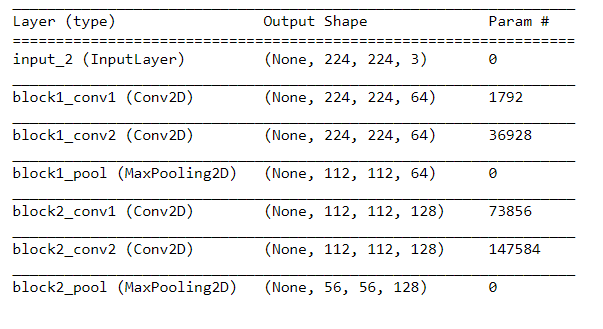
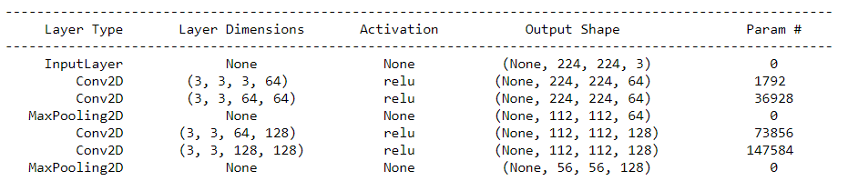

# CNN-architectures

I develope a new summary technique for neural network visualization. Rather than Keras' summary function, my technique is much more simpler and easier to understand input and output connections. Additionally, I display the activation functions and filter dimensions in each layer.

For example, a couple of layers of VGG16 architecture displayer by Keras' summary function:

and a couple of layers of VGG16 architecture displayer by my summary function:

   

You can find the code for my summary function and its usage on visualizing different CNN architectures:

- [VGG-16](https://github.com/onuralg/CNN-architectures/blob/master/cnn-architectures-vgg-16.ipynb)
- [VGG-19](https://github.com/onuralg/CNN-architectures/blob/master/cnn-architectures-vgg-19.ipynb)
- [ResNet50](https://github.com/onuralg/CNN-architectures/blob/master/cnn-architectures-resnet50.ipynb)
- InceptionV3
- InceptionResNetV2
